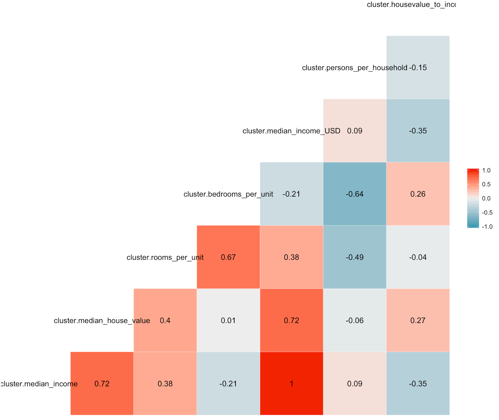

# Data Overview
* The data contains 20640 observations of 10 variables.
* Each row pertains to a block of houses and the median values are used to represent these groups of houses in close proximity to one another.
* **Our aim is to predict the median house value for a particular block in California**

# Data Cleaning
* Check for null values in all the variables
* Null values found in total bedrooms variable. Replace by median value.
* Discard duplicate values, if any

# Create new relevant variables and dropping the variables we will not use

# Preparing the data for clustering – Step 1

* We aggregate the data for each latitude and longitude and store it into a data frame called data_per_block.
* We subset this data frame to keep only the relevant variables that we will use for clustering and store these variables in a new data frame called clustering data.
* We create a function to normalize the data and then normalize all the numeric data.
* We then encode the categorical variables (Ocean proximity, Median Age Group), so that we can use them for our clustering.

# Preparing the data for clustering – Step 2

* We create a SSE curve for running K-means.
* We then lot the curve to get the k value at elbow point. We see that k=4 (graph on the next slide).
* We run k means with the value we got from the SSE curve (k=4) and store it in a data frame called kcluster.
* We then run the fviz_cluster function to check our clusters (By trial and error of the choose.vars values, we see that our clusters have been divided mostly based on ocean proximity).
* We store the clusters into a new data frame called cluster.
* We merge the cluster column in all the data frames by using the key value we used for grouping.

# SSE curve (We see an elbow at k=4)

# Data Visualizations

# Visualization between Median House Value by Ocean Proximity

From the graph we see that,
* Cluster 3 is only for Inland and all the inland values are in cluster 3.
* All the blocks which are less than 1 hour from the ocean are in cluster 2 and cluster 4.
* All the blocks in islands are in cluster 1.
* The locations near bay and near ocean are divided between cluster 1 and cluster 4.
* Inland houses have the least median house value and island houses have the highest.
* There are lot of outliers in the inland houses.
* The median house value of blocks near bay is slightly higher than the blocks near the ocean but the prices are almost comparable.

# Visualization between Median House Value by Median Income

From the graph we can see that:
* The median house value appears to increase with an increase in median income for all the clusters.
* There are more blocks in a higher median house value range for a given income for cluster 1 (near bay area/island/near ocean) as compared to cluster 3 (inland).
* There appears to be a housing cap for the median house value and thus we cannot get the actual picture for these houses above the cap.

# Visualization between Median House Value by Persons per household

Here, we set the limit of persons per household to 15 to eliminate any outliers. There could be data from a shopping centre or a hotel which might give arbitrary values. 

From the graph we can see that:
* There are approximately 2-3 people per house for most of the blocks.
* There are few houses inland with one person per household but all other clusters have significant blocks with one person per household as well.

# Visualization between Median House Value by Rooms Per Unit

From the graph we see that:
* The median house value is the least for the blocks inland and highest for the blocks in island.
* Most houses have approximately between 1-3 rooms per house. 
* There is not much variation in the houses inland while the other locations have significant variations in the median house value.
* There are some houses which are less than 1 hour from ocean which have a very high median house value.
* The median house value for the houses in islands is more than the average for the other locations.

# Visualization between Median Age Group by Ocean Proximity

From the graph we can see that:
* The houses inland are evenly divided between all age groups.
* The strong densities for the 0-17 age groups might indicate a presence of a school or day care centre in those blocks.
* We can easily see the division of clusters based on ocean proximity more clearly here.

# Visualization between Rooms Per Unit by House value to Income

House value to income represents the median house value per median income.\
The maximum number of rooms per unit has been limited to 5 to avoid any outliers.

From this graph we can see that,
* The number of rooms per unit appear to be inversely proportional to the house value to income. This implies that as the houses get less affordable, people prefer to take less rooms.
* The is less variation in house value to income for the blocks in inland as compared to the other locations.
* The outliers imply that there are some houses for which the house values are much higher than the income.

# Linear Modelling (for each cluster)

## Step 1: Checking correlations cluster wise
* We first create different data frames for each cluster.
* We then create a function (get_cluster) to create a data frame that we will use to check correlations.
* We create data frames with all the relevant variables using the above function.
* We get the correlation heat map for all the data frames based on clusters by using the ggcor() function.

### Correlation - Cluster1

### Correlation - Cluster2

### Correlation - Cluster3

### Correlation - Cluster4

## Step 2: Checking Significance

Our aim is to predict the median house value for a particular area in California.

Let us check the significance of Median Income, Persons Per Household and Rooms Per Unit on the Median House Value so that we can keep the relevant variables in our linear model.

### Significance of Median Income, Persons per Household and Rooms Per Unit on Median House Value for models with Cluster 1 and Cluster 2 respectively

From the results above we see that:
* Median Income and Rooms per unit have a low p-value for both Model 1 and Model 2 and are thus statistically significant for predicting the median house value.
* Persons Per Household has a high p-value for Model 1 and low for Model 2 and thus we will not include it in our regression model for Model 1 as it is not statistically significant for predicting the median house value but include it in Model 2.

### Significance of Median Income, Persons per Household and Rooms Per Unit on Median House Value for models with Cluster 3 and Cluster 4 respectively

From the results above we see that:
* Median Income and Rooms per unit have a low p-value for both Model 3 and Model 4 and are thus statistically significant for predicting the median house value.
* Persons Per Household has a high p-value for Model 3 and low for Model 4 and thus we will not include it in our regression model for Model 3 as it is not statistically significant for predicting the median house value but include it in Model 4.

## Step 3 : Run Linear Regression for all the models

We thus create a function for linear modelling with persons per households
and without persons per households

Finally, we call the function to model all the data frames and check the summary for each model.

### Linear Regression -> Cluster 1

The regression line for this model can be defined as:\
Median house value = (4.770 * Median Income (USD)) + ((-12630) * rooms per unit) + 13050\
Adjusted R square = 0.4627

* This implies that for cluster 1 as the median income of the block increases, the median house value also expected increases.
* This also shows that as the rooms per unit increases, the median house value decreases. As we saw, cluster 1 represents houses near the bay area, ocean or islands. This could imply that either this clusters could have observations for hotels, schools or shopping centres where the number of rooms are usually larger for a particular block.

### Linear Regression -> Cluster 2

The regression line for this model can be defined as:\
Median house value = (2.610 * Median Income (USD)) + (51110 * rooms per unit) + (-13230 * Persons Per Household + 83551)\
Adjusted R square = 0.5556

* This implies that as the median income of the people in blocks pertaining to cluster 2 increases, the median house value is also expected to increase.
* As the number of rooms per unit for each block increase, the median house value also increases which implies that in cluster 2, bigger houses have a higher median house value.
* As the number of people per household increase, the median house value decreases which implies that the higher value houses tends to have less people per household.

### Linear Regression -> Cluster 3

The regression line for this model can be defined as:\
Median house value = (3.341 * Median Income (USD)) + (1.291 * rooms per unit) + 9864\
Adjusted R square = 0.4938

* This implies that as the median income of the people in blocks pertaining to cluster 3 increases, the median house value is also expected to increase.
* As the number of rooms per unit for each block increase, the median house value also increases which implies that in cluster 3, bigger houses have a higher median house value.
* Persons per household does not affect the median house value of cluster 3 significantly.

### Linear Regression -> Cluster 4

The regression line for this model can be defined as:\
Median house value = (3.438 * Median Income (USD)) + (4284 * rooms per unit) + (-13410 * Persons Per Household + 94970)\
Adjusted R square = 0.5312

* This implies that as the median income of the people in blocks pertaining to cluster 4 increases, the median house value is also expected to increase.
* As the number of rooms per unit for each block increase, the median house value also increases which implies that in cluster 4, bigger houses have a higher median house value.
* As the number of people per household increase, the median house value decreases which implies that the higher value houses tends to have less people per household.

# Insights/Hypotheses
* In California, the median house value for the houses on islands is the highest and least for the houses which are inland. The median house value for houses near bay and near ocean are between these two locations. While comparable, the median house value of houses near bay is slightly higher than the median house value of houses near ocean.
* There is less variation in the house value to income in the blocks located inland as compared to other areas. This implies that the house value is almost proportionate to income for most houses inland. Other locations have few houses which have a higher house value as compared to the income of that block.
* Most houses have between 2-4 people per household and 1-3 rooms per unit.
* We see that for most houses in a block, the median house value is expected to increases as the the median income of that block increases. This trend seems to be true across all the locations in California.
* We see that as the number of rooms per unit increases, the median house value is expected to increase for most blocks in California. 
* Finally, we see that persons per household does not have a significant impact on the expected median house value of a particular block in California.
